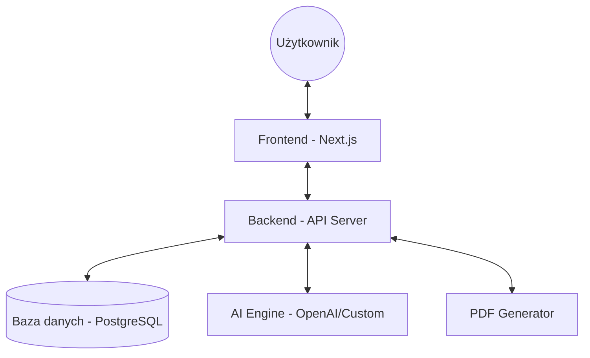

# Architecture - Architektura projektu

SmartQuote-AI to nowoczesna aplikacja webowa zbudowana w architekturze klient-serwer, wspomagana przez silnik sztucznej inteligencji.

## Diagram Struktury Systemu

## Główne Komponenty

### 1. Frontend (Next.js)
Wykorzystuje **App Router** do zarządzania ścieżkami i renderowania po stronie serwera (SSR) oraz klienta (CSR). 
- **Tailwind CSS**: Do stylowania i zapewnienia responsywności.
- **NextAuth.js**: Do zarządzania sesjami i autoryzacją.
- **Context API**: Do zarządzania globalnym stanem chatu AI.

### 2. Backend (API Server)
Serwer odpowiedzialny za logikę biznesową, walidację danych i komunikację z bazą danych.
- **Autoryzacja**: JWT (JSON Web Tokens).
- **Service Layer**: Logika zarządzania klientami, ofertami i kontraktami.

### 3. AI Module
Integracja z modelami językowymi (LLM) do:
- Automatycznego generowania ofert.
- Analizy potencjału klientów.
- Inteligentnego chatu wspomagającego sprzedaż.

## Flow Danych w Systemie

### Tworzenie Oferty AI
1. Użytkownik wprowadza opis w komponencie `AIOfferGenerator`.
2. Frontend wysyła request do `/api/ai/generate-offer`.
3. Backend przekazuje opis do silnika AI wraz z kontekstem użytkownika/klienta.
4. AI zwraca sformatowaną strukturę oferty.
5. Użytkownik weryfikuje dane i zapisuje ofertę w bazie danych.

## Decyzje Architektoniczne i Uzasadnienie

- **Next.js (React)**: Wybrany ze względu na doskonałe wsparcie SEO (dla publicznych części), wydajność (SSR/Static Export) oraz bogaty ekosystem komponentów.
- **TypeScript**: Zastosowany w celu minimalizacji błędów runtime i ułatwienia refaktoryzacji w miarę wzrostu projektu.
- **Tailwind CSS**: Umożliwia szybkie budowanie interfejsów bez konieczności pisania dużych ilości niestandardowego CSS, co przyspiesza proces developmentu.
- **NextAuth.js**: Standard branżowy dla aplikacji Next.js, zapewniający bezpieczeństwo i łatwą integrację z różnymi providerami (OAuth, Credentials).
